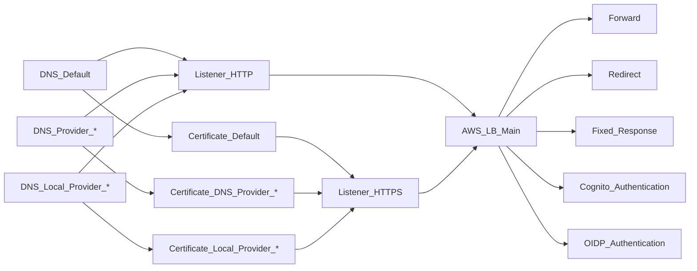

# Application Load Balancer

## Assumptions

* we have a DNS domain **domain.name**
* we have a Target Group ARN **target_group.arn**
* we deploy a single ALB for all our services within this account
* we have the main and maybe some extra ASG backend services accessed by
  this ALB
* each backend service is accessed via one or many of
  **[subdomain].domain.name/[path]**
* subdomain may be empty or a wildcard (\*), path may be empty
* each backend service will receive a target group ARN from the ALB module
* we receive a mandatory definition of the main service to deploy at this ALB as
  a list of tuples (subdomain, path), expressed in YAML as:

```yaml
main_service:
    - subdomain1:
      path1:
    - subdomain2:
      path2:
```

* we receive an optional list of extra services to deploy at this ALB, each
  service has a list of tuples (subdomain, path), expressed in YAML as:

```yaml
service1:
    - subdomain1.1:
      path1.1:
    - subdomain1.2:
      path1.2:
service2:
    - subdomain2.1:
      path2.1:
    - subdomain2.2:
      path2.2:
```

* all domain names used above need:
    - a Route53 ALIAS record
    - a certificate

* we deploy a **stub HTTP service**, whose backend service will redirect everything to HTTPS. This can be:
    - same

This module creates an ALB infrastructure as follows:


## Test

```sh
cd test
terraform init
terraform apply
terraform destroy
```
